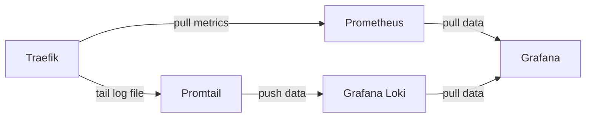

# Monitoring Traefik HTTP Logs with Promtail + Grafana Loki + Grafana

A docker compose example, which extends from [Monitoring Traefik metrics with Prometheus + Grafana](../traefik-prometheus-grafana/README.md) and [Monitoring Traefik HTTP Logs with Promtail + Grafana Loki + Grafana](../traefik-promtail-loki-grafana/README.md), has been designed specifically to monitor Traefik **metrics** and **logs**.

The project is automated **provisioning** with `datasources` & `dashboards`:

- Facilitate DevOps, reducing chores that you have to visit  **Grafana** Web UI to configure `datasource` and import `dashboard` every time setting up a new infrastructure.
- The default `datasource` and `dashboard` can be restored after restarting, if you delete them accidentally.
- Provisioning one `datasource` in `./datasources/datasource.yaml` file
- Provisioning two `dashboard` with two `./dashboards/*.json` files that I use from others but do a little **tweak**. These awesome creations are:
  - `17346_rev7_access_log.json`: I take the json file from:  
    - `17346_rev7.json`: Traefik Official Standalone Dashboard
    - ID: `17346`
    - URL: https://grafana.com/grafana/dashboards/17346-traefik-official-standalone-dashboard/

However, I do some modification on `"datasource"` in these `dashboard.json` files for `Prometheus` datasource and `Loki` datasource.

## Set `datasource` in `dashboard.json` when provisioning

If you are using an existed `dashboard.json` which is downloaded from grafana dashboard center, it maybe show `{..., "datasource": {"uid": ${DS_PROMETHEUS}}}`. We need to replace it with a right `datasource` by doing either of the following:

- Set `{"datasource":null}`: means dashboard will use the `default` datasource.
- Set `{"datasource":"Prometheus"}`: means dashboard will use the datasource of **name**: `Prometheus`.
- Set `{"datasource": {"type": "prometheus", "uid": "c1d0d42c"}}`: means dashboard will use the datasource of **uid**: `c1d0d42c`.

## Example

Traefik     :   http://localhost:8080/metrics
Loki        :   http://localhost:3100  and [Grafana Loki HTTP API](https://grafana.com/docs/loki/latest/reference/api/)
Grafana     :   http://localhost:3000
Prometheus  :   http://localhost:9090
Web         :   http://localhost/foo

## References

[Visualizing Traefik Metrics and HTTP Logs in Grafana](https://blog.lrvt.de/traefik-metrics-and-http-logs-in-grafana/)